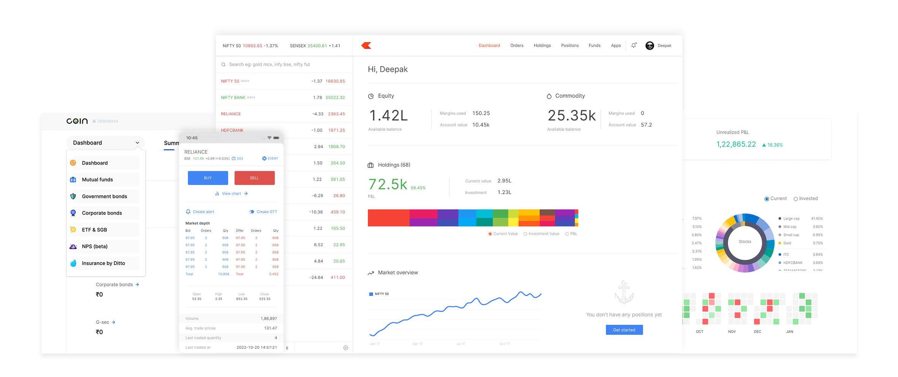

 Zerodha-Clone
---

   

 Overview
---

   The Zerodha Clone is a frontend project that replicates the user interface and experience of the popular Indian stockbroking platform, Zerodha. The project is built using React.js, with a focus on creating a clean, responsive, and intuitive design that mirrors Zerodha's platform.

 Features
---

   Responsive design with Bootstrap

   Clean and intuitive UI

   Fast, lightweight frontend setup

---

 Tech Stack

   HTML5

   CSS3

   JavaScript 

    
   ---

 License

   This project is licensed under the MIT License.

